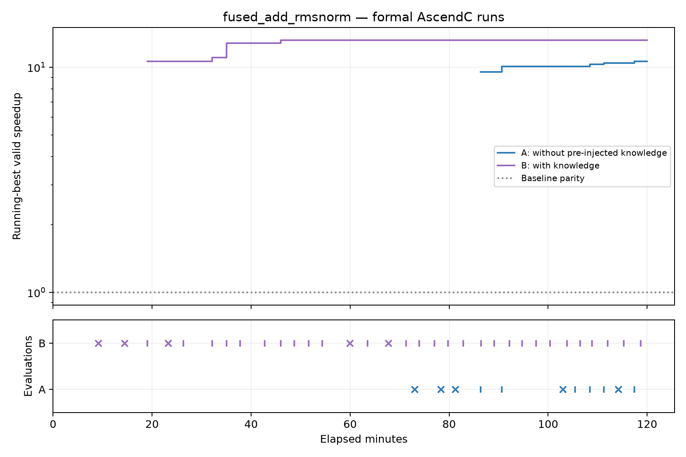

# FusedAddRmsNorm：正式AscendC实验

A/B均通过正确性；保留原AscendC实验的固定gate最佳结果。

| 算子 | Setting | 正确性 | Baseline (ms) | 实现 (ms) | 加速比 |
|---|---|---|---:|---:|---:|
| fused_add_rmsnorm | A | ✓ | 6.009090 | 0.565930 | 10.6181× |
| fused_add_rmsnorm | B | ✓ | 6.019270 | 0.457040 | 13.1701× |

## 算子定义

hidden_states、residual：BF16[8192,7168]；weight：BF16[7168]。
输出output、residual_out：各BF16[8192,7168]。
两输入转FP32相加，residual_out为该和的BF16舍入；output用未舍入FP32和执行RMSNorm（epsilon=1e-6），乘FP32 weight后转BF16。完整reference见problems/definitions/fused_add_rmsnorm.json。

## 迭代与限制

A完成11次评测（9种源码），最佳version10；B完成33次评测（29种源码），最佳version9。
首次正确结果分别出现在86.36分钟、19.02分钟。A=NPU2，B=NPU3，各自使用同卡Baseline。
前半程存在私有计时/固定gate外编译探测，随后向双方发送相同协议纠正并同session恢复，预算不变。私有测量不计入成绩，不能排除其对探索决策的影响。
两组均运行7200秒，首末响应跨度7187.802秒、7190.364秒；末段部分resume无新评测。
A/B各有1条被中断响应缺少完整usage，累计Token为可观测值。单次对照不作统计因果推断。

## 评测与复现

DeepSeek-V4.1-Flash + Codex，1M上下文，每组7200秒；Ascend910B3、CANN9.1.0、torch2.10.0+cpu、torch_npu2.10.0.post4，最终候选语言均为AscendC。
A=无预注入专家知识；B=有专家知识。A可自行查阅公开API。Baseline为题目PyTorch reference，**不是已有最优专用算子**。
固定gate校验shape/dtype/device，并使用torch.allclose(rtol=atol=0.01)。NPU events计时：10次warmup、50次repeat、3个trial，取各trial中位数的中位数；编译与输入准备不计时。仅覆盖给定workload。

先在仓库根目录准备Python环境（Python3.11+、项目依赖、torch、safetensors）和910b SSH连接，执行 `scripts/ascend/task2.sh sync` 与 `scripts/ascend/task2.sh bootstrap`，确保指定NPU空闲。
随后在本算子目录执行 `./run_benchmark.sh --setting with_memory --device 2`；A改为without_memory。可用PYTHON指定解释器。
脚本以seed=0生成输入，在独立临时工作区重新调用固定gate，不启动模型、不读取模型Key、不覆盖正式结果。
本次整理只校验脚本入口和归档一致性，未额外运行NPU测量。

## 曲线与证据

[时间PDF](plots/speedup-vs-minutes.pdf) · [Token PNG](plots/speedup-vs-tokens.png) · [Token PDF](plots/speedup-vs-tokens.pdf)

每组CSV在plots/；曲线仅以固定gate的正确结果更新最优值，失败点标为×，正确点标为竖线，无有效结果不绘制虚构曲线。Token包含累计缓存输入，不等于生成Token或费用。
每组保留submission/、versions/、脱敏events.jsonl、baseline.json、result.json、duration-audit.json。
原始API请求/响应、Codex Trace和工具正文完整留在本地，不随此交付包分发；events不是完整Trace。失败/中断快照同样保留。
最终有效submission与选中version逐字节核验一致。SHA256SUMS.json覆盖正式文件；selection.json给出最终选择。
在仓库根目录执行 `.venv-ascend/bin/python experiment/ascend/generation/fused_add_rmsnorm/build_report.py` 可离线重画两个算子的图，不调用模型或NPU。

[本算子A/B汇总表](results.csv) · [优化技巧表](optimization-techniques.md) · [校验清单](SHA256SUMS.json)

## Codex Trace补充

两组均提供trace.jsonl、session.jsonl及完整事件类别的events.jsonl。记录数量与私有原始文件核对一致，API与评测元数据保留；所有自由文本正文脱敏。详见各组TRACE_ACCESS.md和trace-export-audit.json。本包不是未删减的原始会话。
