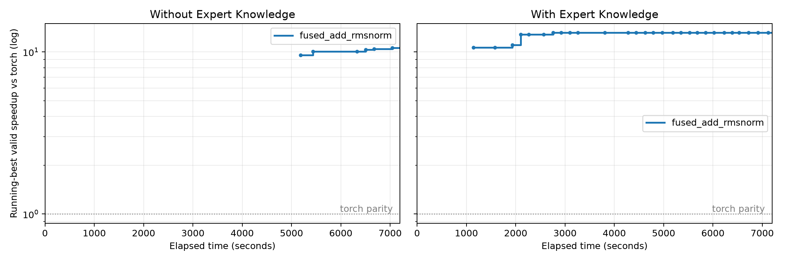

# FusedAddRmsNorm：AscendC 生成实验

2026-09-21/22，DeepSeek-V4.1-Flash（官网 API ID `deepseek-flash`）+ Codex CLI 0.153.4，
1M 上下文。A/B 均强制 AscendC，各运行7200秒。此前中止的 Triton 运行按用户要求删除，
本轮使用全新 session、Baseline 和版本记录，不混用旧成绩。

## 结果

| Setting | Correct | Baseline | 最佳延迟 | 加速比 | 最佳版本 | 完成评测 / 不同源码 |
| --- | --- | --- | --- | --- | --- | --- |
| A：无预注入专家包 | ✓ | 6.009090 ms | 0.565930 ms | 10.618× | version10 | 11 / 9 |
| B：专家包 | ✓ | 6.019270 ms | 0.457040 ms | 13.170× | version9 | 33 / 29 |

Baseline 是题目 definition 的 PyTorch reference 在各自 NPU 上实测，
不是 CANN/torch-npu 最优融合算子。结果不能解释为优于已有专用 AddRmsNorm 算子10–13倍。
A=NPU2，B=NPU3；一次A/B实验，不作统计因果结论。

首个有效评测：A 在86.36分钟，B 在19.02分钟。B更早得到有效结果，最终最佳延迟也更低。
`submission/` 为控制器选出的最佳有效版本，与相应 versions 源码逐字节一致；
`agent_submission/` 另存模型结束时的原始提交。哈希见各组 submission-sha256.json。
所有失败和较慢候选均保留，不补跑、不修改模型生成源码。

## 算子和环境

输入 hidden_states、residual：[8192,7168] BF16；weight：[7168] BF16。
输出 output、residual_out：各[8192,7168] BF16。
先将两输入转FP32相加，residual_out为该和的BF16舍入；
output由未舍入的FP32和计算RMSNorm，epsilon=1e-6，再乘FP32 weight并转BF16。
完整 reference/workload 见 problems/。输入 seed=0，两组一致，manifest保存哈希；大输入文件不入Git。

服务器 ssh 910b，Ascend910B3，容器pjj-fmha-opt；CANN9.1.0，
torch2.10.0+cpu / torch_npu2.10.0.post4。固定入口 scripts/ascend/eval.py，
`--language ascendc` 拒绝Python/Triton；原生算子及C++/pybind wrapper位于 submission/solution/。
正确性使用固定gate的shape/dtype/device与torch.allclose(rtol=atol=0.01)。
当前流NPU events：10 warmup，50 repeat，3 trials，中位数的中位数；编译和输入准备不计时。
结果只覆盖本次固定workload。

## 专家包和干预

A不预注入专家资料，可自行检查公开API及已安装的头文件。
B获得额外专家上下文和固定commit的CANN ops-nn AddRmsNorm：host tiling、single_n、multi_n、
merge_n、split_d等实现。见 with_memory/expert/、cann/source.json和experiment-policy.json；
保留许可证和SHA256。资料为设计参考，最终候选仍须自行生成并通过同一gate。

前半程A使用私有NPU计时，双方均曾在固定gate之外做编译探测。
用户要求发现偏差及时纠正后，UTC16:12:10向双方AGENTS加入相同的协议要求，
中断CLI并在同一session恢复，截止时间不变，不添加算法提示。
已验证两组新的API请求包含纠正内容；之后的监控未再发现私有计时。
仅固定gate测量进入成绩/曲线，早期私有结果不计入，但其对探索的影响无法排除。
本轮因此是有协议偏差且中途纠正的实验，不声称为完全无干预对照。
纠正前后AGENTS、protocol-correction.txt和operator-audit.jsonl均保存。

## 时长与Trace核验

北京时间2026-09-21 23:11:45至09-22 01:11:45，两组预算均7200秒。

| Setting | 首次完整响应UTC | 最后完整响应UTC | 响应跨度 | API请求/响应 | resume | 已记录total_tokens |
| --- | --- | --- | --- | --- | --- | --- |
| A | 15:11:46.663 | 17:11:34.466 | 7187.802秒 | 218/218 | 14 | 23,608,337 |
| B | 15:11:46.798 | 17:11:37.163 | 7190.364秒 | 263/263 | 11 | 30,661,306 |

所有响应HTTP200，但A截止时1条、B协议纠正时1条响应被中断，未收到完整usage。
请求响应原始压缩记录仅本地保留，已验证可解压且请求ID配对。Token合计/曲线是可观测usage之和，
缺少上述中断请求的最终用量，不代表精确账单或生成Token数。
每组仅一个session ID；末段部分resume只返回结束说明，没有新评测。
首末响应跨度接近两小时属实，但不等于每一分钟都有效优化。
11/33次评测均有启动与完成记录；审计见 audit-summary.json、duration-audit.json。

## 曲线与产物



- [时间 PDF](plots/speedup-vs-seconds.pdf)
- [Token PNG](plots/speedup-vs-tokens.png) / [PDF](plots/speedup-vs-tokens.pdf)
- [全部评测时间线](plots/evaluation-timeline.png) / [PDF](plots/evaluation-timeline.pdf)
- [A CSV](plots/fused_add_rmsnorm-without_memory.csv)、[B CSV](plots/fused_add_rmsnorm-with_memory.csv)

阶梯仅由compile/correctness/profile均通过的评测更新；CSV at为启动时间，seconds为完成时累计耗时。
公开产物包含脱敏events.jsonl、versions/、submission/、baseline/result/duration-audit、
prompt、公开配置及continuation提示。原始API请求/响应和Codex session/trace仅本地保留；
公开events省略API tool-call payload。完整输入上下文不公开，复现需另行本地配置。

从仓库根目录重新画图（不调用模型或NPU）：

```sh
plot_root=$(mktemp -d)
ln -s "$PWD/experiment/ascend/generation/fused_add_rmsnorm" "$plot_root/fused_add_rmsnorm"
for axis in seconds tokens; do
  .venv-ascend/bin/python scripts/ascend/plot.py --root "$plot_root" \
    --out experiment/ascend/generation/fused_add_rmsnorm/plots --x "$axis" --y speedup
done
.venv-ascend/bin/python experiment/ascend/generation/fused_add_rmsnorm/audit.py
```

新实验的环境准备与固定评测接口见 ../NEXT_RUNS.md；不要用collect覆盖本审计报告。
