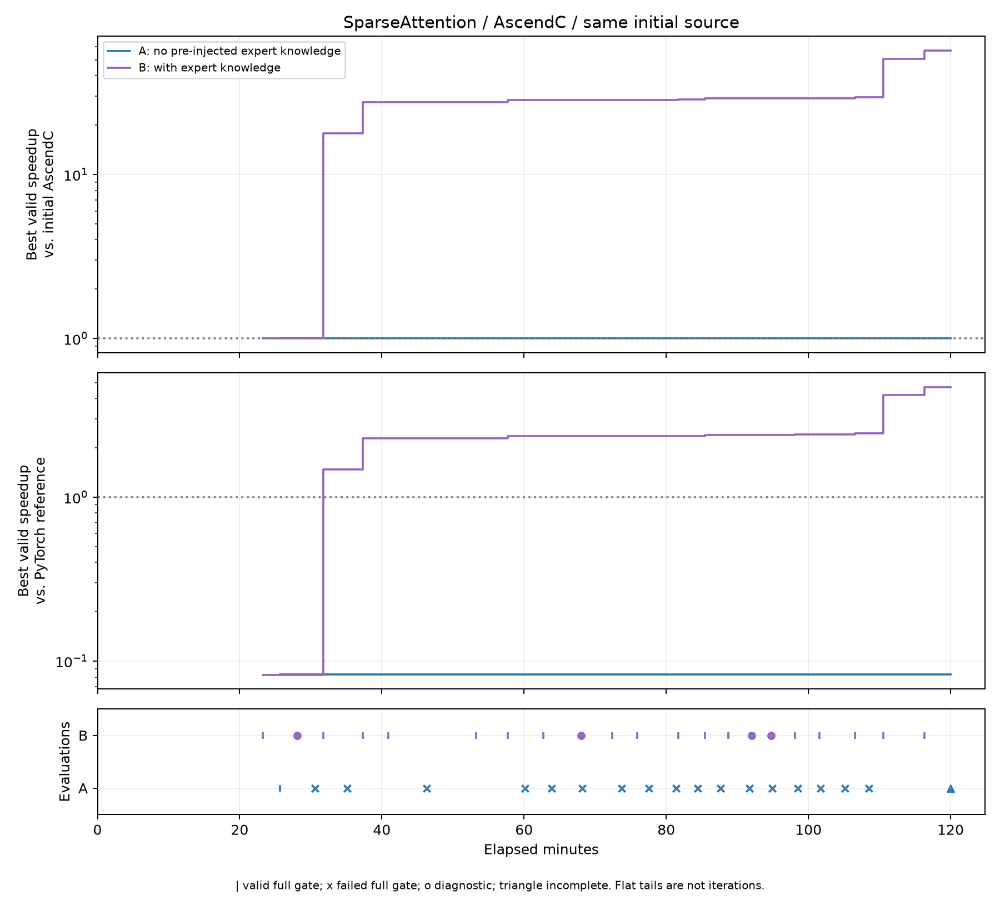

# SparseAttention：正式 A/B 结果

两组使用相同的正确 AscendC 初始源码，各运行7200秒。A无预注入专家知识；B提供相关API、通用验证示例及相似算子源码作为专家参考，由模型实现和优化。DeepSeek-V4.1-Flash + Codex，1M上下文，Ascend910B3。

| Setting | 正确性 | 初始实现(ms) | PyTorch reference(ms) | 最佳(ms) | 相对初始 | 相对reference |
|---|---|---:|---:|---:|---:|---:|
| A | ✓（保留初始实现） | 5648.614014 | 470.202118 | 5648.614014 | 1.0000× | 0.0832× |
| B | ✓（version20） | 5648.985107 | 466.355347 | 99.355560 | 56.8563× | 4.6938× |

主指标是相对本组新测初始实现的加速比；另报告相对题目PyTorch reference。初始实现用于相同起点，不宣称社区高性能baseline。A未找到正确且更快的候选，不能把保留初始实现描述为成功优化。

## 定义

输入：q BF16[8192,128,576]、kv BF16[8192,1,576]、indices int32[8192,1,2048]。
输出：BF16[8192,128,512]、max_logits及lse各FP32[8192,128]。
按稀疏索引执行MLA，KV前512维作为V；scale=0.1352337788608801，lse为自然对数。有效索引互异、无序且因果，其余为-1；以problems中的完整definition/workload为准。

B使用Cube计算QK/PV、Vector计算softmax，逐步优化缓冲复用、跨流事件同步、分块和搬运；最终跳过无效索引搬运，并调整矩阵K分块。输出通过固定gate容差，不宣称全FP32逐位一致或其他shape性能。

## 迭代与限制

A保留19个快照：18次完成评测，version1–17未通过，version18未完成；最佳为初始version0。B保留21个快照、18份不同源码：17次完整评测、4次诊断检查。诊断没有性能成绩，不画成正确或失败的性能点。

两组预算均约7200秒，首末API响应跨度A为7190.118秒、B为7195.177秒。A恢复14次、B恢复50次；B有44个恢复片段没有工具调用。末段重复结束不算有效优化，响应跨度不代表持续两小时有效工作。

A曾越界读取本机已有公开API/通用示例，范围已纠正；因此A表示“无预注入专家知识”，不是“从未查阅资料”。A运行中修复了编译诊断日志回传。B启动时已有该修复，且额外提供compile/check快速诊断接口。B也发生范围纠正。数值容差、完整评测计时和预算保持一致，但开发反馈条件不完全相同；此配对用于呈现选定实验结果，不能将性能差异完全归因于专家知识。监督者未修改模型候选。原始偏差、干预和失败记录保留本地。

## 复现

环境：Ascend910B3、CANN9.1.0、torch2.10.0+cpu、torch_npu2.10.0.post4，Python3.11+及项目依赖。
固定gate：torch.allclose(rtol=atol=0.01)；NPU events；warmup=10、repeat=50、trials=3，取各trial中位数的中位数；编译与输入准备不计时。

先在仓库根配置910b SSH/容器环境，执行 `scripts/ascend/task2.sh sync` 和 `scripts/ascend/task2.sh bootstrap`，确认目标NPU空闲。然后在本目录执行：

```bash
./run_benchmark.sh --setting without_memory --device 2
./run_benchmark.sh --setting with_memory --device 3
```

脚本以seed=0生成题目输入，在新临时目录重新调用固定gate，不启动模型、不读取模型Key、不覆盖归档。本次整理只校验入口与证据一致性，没有追加NPU测量。

## 文件

- without_memory/、with_memory/：最佳submission、相同initial_submission、全部versions、脱敏events、结果及时长记录。
- plots/：时间及Token两套PNG/PDF、逐版本CSV。
- plots/plot.py：从脱敏记录离线重画对比图；不调用模型或NPU。



[时间PDF](plots/speedup-vs-minutes.pdf) · [Token PNG](plots/speedup-vs-tokens.png) · [Token PDF](plots/speedup-vs-tokens.pdf)

曲线只用预算内、无重叠、正确的完整评测更新最优值。水平尾段不表示新迭代；Token含缓存输入，不等同生成Token或费用。首次有效测量前留空。
完整API/Codex Trace与专家资料仅本地保存；此目录是脱敏结果包，events不是完整Trace。最佳源码与选中快照逐字节一致；校验清单见SHA256SUMS.json。

[本算子A/B汇总表](results.csv) · [优化技巧表](optimization-techniques.md) · [校验清单](SHA256SUMS.json)
