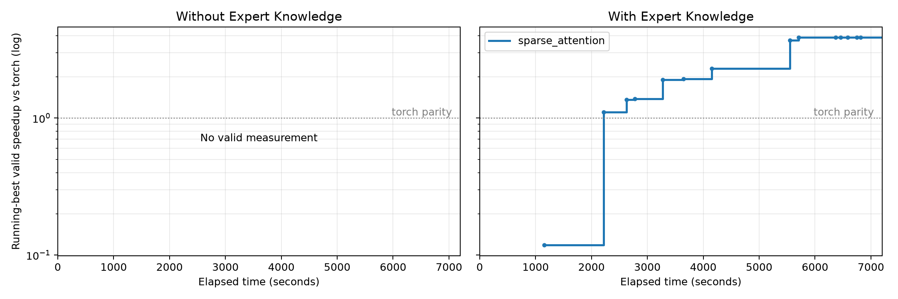

# SparseAttention：DeepSeek 生成实验

2026-09-21，Codex CLI 0.153.4 + DeepSeek 官网 `deepseek-flash`
（当天对应 DeepSeek-V4.1-Flash），1M 上下文。A/B 各运行 7200 秒。
B 得到通过固定评测的实现；A 未得到正确实现。FusedAddRmsNorm 按用户要求尚未启动。

## 结果

| Setting | Correct | Baseline | 最佳有效延迟 | 加速比 | 评测启动/完成 | 自动恢复 |
| --- | --- | --- | --- | --- | --- | --- |
| A：无预先注入专家上下文 | ✗ | 470.1277 ms | — | — | 12 / 10 | 5 次 |
| B：注入专家上下文 | ✓ | 457.0372 ms | 117.7193 ms | 3.882× | 15 / 15 | 20 次 |

Baseline 是题目 definition 的 PyTorch reference 在各自 NPU 上的实测时间，
不是 torch-npu 的最佳专用稀疏注意力算子。A/B 使用不同卡，不把绝对延迟差异全归因于专家知识。
A 选择 AscendC，B 选择 Triton；语言由模型自主选择。本次只有一对运行，不能作统计因果结论。

B 发布源码是固定 gate 中最优的 `versions/version8/submission/`，与
`with_memory/submission/` 逐字节一致；哈希见 `submission-sha256.json`。
模型结束时的原始提交另存 `agent_submission/`，不以模型最终自述替代测量。
A 的 submission 是失败候选，不能用于报告有效延迟。`result.status=ok` 表示控制器完成
运行/时长审计，不代表算子正确；正确性必须读取 correctness_passed。

## 曲线与迭代



- [时间曲线 PDF](plots/speedup-vs-seconds.pdf)
- [累计 Token 曲线](plots/speedup-vs-tokens.png) / [PDF](plots/speedup-vs-tokens.pdf)
- [全部固定评测时间线](plots/evaluation-timeline.png) / [PDF](plots/evaluation-timeline.pdf)
- 每次完成评测的原始数据：[A CSV](plots/sparse_attention-without_memory.csv)、[B CSV](plots/sparse_attention-with_memory.csv)。

纵轴为 running-best valid speedup，对数坐标，1× 为 torch parity。
仅 compile、correctness、profile 全部通过的评测更新最优值；较慢或失败候选不提高曲线。
A 没有有效测量，因此显示空面板，而不是伪造 0× 或 1× 曲线；其真实尝试见评测时间线和版本目录。
累计 Token 是 API usage 的 total_tokens 之和，包含多次输入上下文，不等于生成 token 或美元成本。

B 的改进台阶约为 0.118× → 1.106× → 1.357× → 1.384× → 1.905× →
1.923× → 2.299× → 3.694× → 3.882×；以 events/CSV 精确数值为准。

## 两小时时长核验

两组模型窗口均为北京时间 **20:05:23–22:05:23**（UTC 12:05:23–14:05:23）。

| Setting | 首个成功响应 UTC | 最后成功响应 UTC | 响应跨度 | API 次数 | API total_tokens |
| --- | --- | --- | --- | --- | --- |
| A | 12:05:25.554 | 14:05:18.668 | 7193.114 秒 | 291 | 36,544,700 |
| B | 12:05:25.457 | 14:05:19.900 | 7194.442 秒 | 243 | 29,841,791 |

每组始终是同一个 session ID，提前 final 后通过 resume 恢复，日志追加。
原始本地记录已核验：两组成功响应均有完整 usage，API 请求/响应 ID 配对。
具体核验见 `audit-summary.json` 和各组 `duration-audit.json`。

**限制：末段多次 resume 只得到模型的结束说明，没有新增候选评测。**
因此首末响应接近两小时属实，但并非每一分钟都发生有效优化；不能单凭响应跨度声称连续有效探索。
未延长预算、补写时间戳或给 A 注入人工提示。

## 算子定义

固定测试：T=8192、H=128、KVH=1、QK=576、V=512、TOPK=2048。

| Tensor | 方向 | Shape | Dtype |
| --- | --- | --- | --- |
| q | 输入 | [8192,128,576] | BF16 |
| kv | 输入 | [8192,1,576] | BF16 |
| indices | 输入 | [8192,1,2048] | int32 |
| output | 输出 | [8192,128,512] | BF16 |
| max_logits、lse | 输出 | 各 [8192,128] | FP32 |

每个 token 的前 min(2048,t+1) 个索引有效、互异、无序且因果，其后为 -1。
kv 前 512 维用于 V；softmax scale 固定 0.1352337788608801，lse 使用自然对数。
完整定义及 reference 在 `problems/definitions/sparse_attention.json`。
原仓库缺输入文件，使用 seed=0 生成，两组输入一致；生成环境/文件哈希在 inputs manifest。
性能与正确性结果仅覆盖本次固定 workload，不声称已泛化到其他 shape。

## 环境和评测

- 服务器 ssh `910b`，Ascend 910B3；容器 `pjj-fmha-opt`，A=NPU2，B=NPU3。
- CANN 9.1.0；torch 2.10.0+cpu、torch_npu 2.10.0.post4、Triton 3.2.0。
- 固定入口 `scripts/ascend/eval.py`；NPU 当前流 events，10 warmup、50 repeat、3 trials，
  统计各 trial 中位数的中位数。编译和输入准备不计入算子延迟。
- 正确性按题目输出合同、现有 gate 的 torch.allclose(rtol=atol=0.01) 判定。
- B 使用约 18 GiB 的 KV 打包中间缓冲区（另有输入、输出及运行时内存），不是零工作区实现。

## 专家资料与协议偏差

B 获得额外专家上下文，A 不预注入。相关输入上下文不在公开产物中分发。

必须披露的实际行为：

- A 自主下载了公开 Ascend API 文档/知识仓库，因此“无专家知识”准确含义是
  **无预注入专家上下文**，不是隔绝联网或禁止自主检索；详见审计记录。
- B 在 `/tmp` 运行了额外编译探针和私有计时，偏离“只用固定 gate 计时”的提示要求。
  私有结果不进入成绩表或曲线，但确实可能影响搜索决策，本次不是完全遵守该条协议的对照。
- A 的 version3 和 version11 没有完成事件；保留启动、源码和 Trace，视作中断，不能计为通过。
  模型自述 version11 数值失败不替代缺失的 gate 完成事件。
- 远程 root 所有的 extra-info 目录造成一次 rsync 失败；双方采用相同同步排除修复，
  各自 events 中有 infrastructure_fix，未改测量或算子源码，不扣除耗时。
- A 曾执行宽泛 pkill；已记录审计。前次 910B1 启动因卡被占用而中断，A/B 分别有
  6/7 次 API 响应、0 次评测；独立证据保留在 `~/klineage-task2-interrupted/20260921T103549Z/`，
  不合并为本轮结果。

## Artifact

公开产物保留脱敏 events.jsonl（API时间/用量与评测事件）、versions/、submission/、
baseline.json、result.json、duration-audit.json及公开配置。原始API请求/响应、
Codex session/trace仅本地保留，不在公开仓库分发；API tool-call payload已从公开events移除。
operator-audit.jsonl记录审计观察，pause-after-sparse.json记录暂停后续算子的请求。

重新生成曲线（仓库根目录；仅使用归档数据，不调用模型或 NPU）：

```sh
plot_root=$(mktemp -d)
ln -s "$PWD/experiment/ascend/generation/sparse_attention" "$plot_root/sparse_attention"
for axis in seconds tokens; do
  .venv-ascend/bin/python scripts/ascend/plot.py \
    --root "$plot_root" \
    --out experiment/ascend/generation/sparse_attention/plots --x "$axis" --y speedup
done
.venv-ascend/bin/python experiment/ascend/generation/sparse_attention/audit.py
```

CSV 的 at 为评测启动时间，seconds 为评测完成时的累计耗时；阶梯在结果可用时更新。
原始 Trace 本地保留，公开版本快照完整保存，勿用 collect.py 覆盖本审计说明。
下一算子尚未启动，等待用户查看本轮结果后决定。
